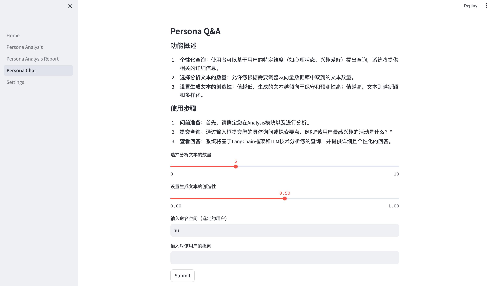
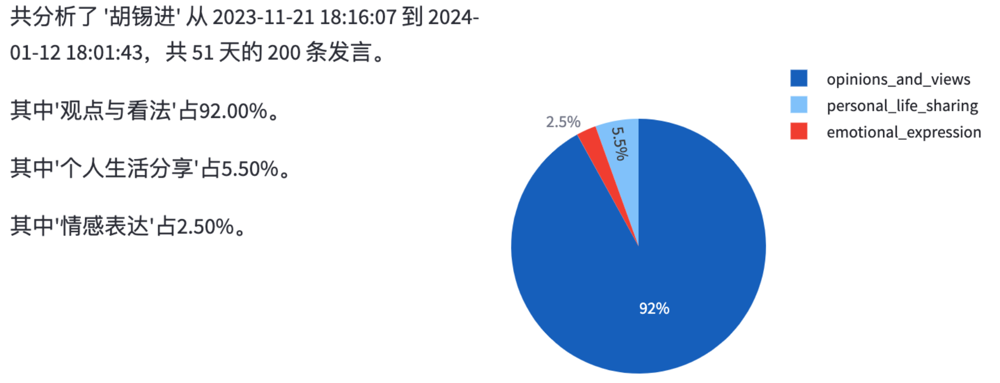
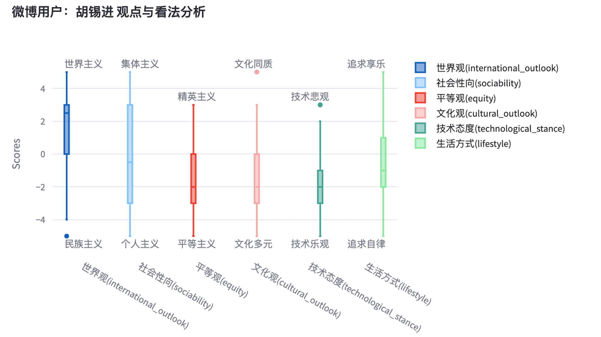
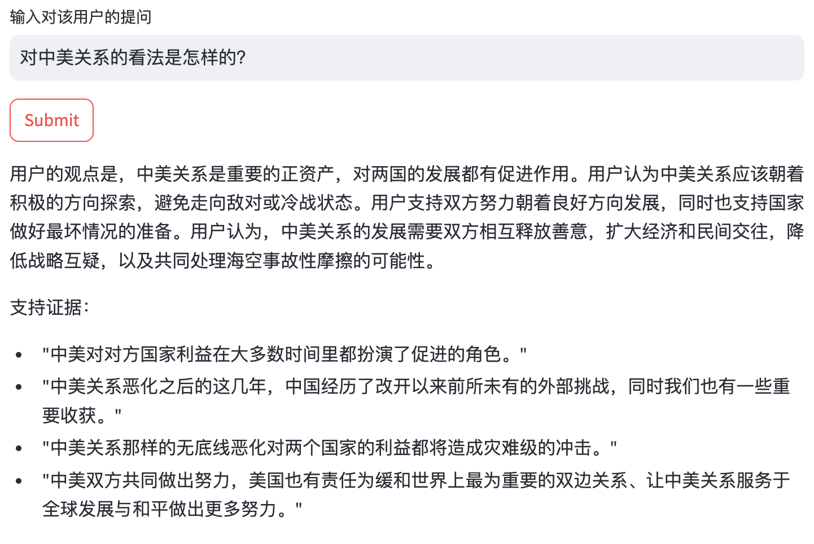

# Design and Implementation of a User Portrait Analysis and Interaction System Based on Langchain
### (基于Langchain的用户画像分析与交互系统的设计与实现)

---
### Introduction

This system utilizes the **Langchain** framework and Retrieval Augmented Generation (RAG) technology.  
It aims to create multi-dimensional user profiles from social media interactions, including traits such as personality, psychological state, and interests.   

The core components of the system include:
- User Profiling Generation Module  
- Dialogue Interaction Module  

They utilize Pinecone's vector database for efficient information retrieval and the GPT-3.5 model for deep analysis using predefined prompts.

### System Architecture

### User Profiling Generation Module
This module extracts user statements from social media and categorizes them based on content using structured analysis via Langchain. The categorized data is stored in the Pinecone vector database to facilitate efficient retrieval and usage. Initial data collection is automated using existing open-source Weibo crawler tools, with data subsequently stored in JSON format to lay the foundation for processing and analysis.

### Dialogue Interaction Module
This module implements the user interface that allows users to submit queries and receive system-generated responses. The responses are generated by the GPT-3.5 Turbo model, employing RAG technology that leverages user profile data stored in the Pinecone database. This module constructs a Q&A interaction system that processes and responds to user inquiries based on their social media data.

### Technical Stack
- **Frontend**: Developed using the Streamlit library.
- **Backend**: Employs GPT-3.5 Turbo for processing user statements with backend support from Langchain to optimize data processing pathways. 
- **Data Vectorization**: Utilizes OpenAI's text-embedding-ada-002 model for text data vectorization, supporting information storage and query operations in the vector database.

This architecture ensures that each component works in concert according to design specifications, effectively capturing user behavior and psychological characteristics on social media platforms.

## Result Display
Currently, the system only has Chinese language support & result. Maybe I will add English support & result in the future.

